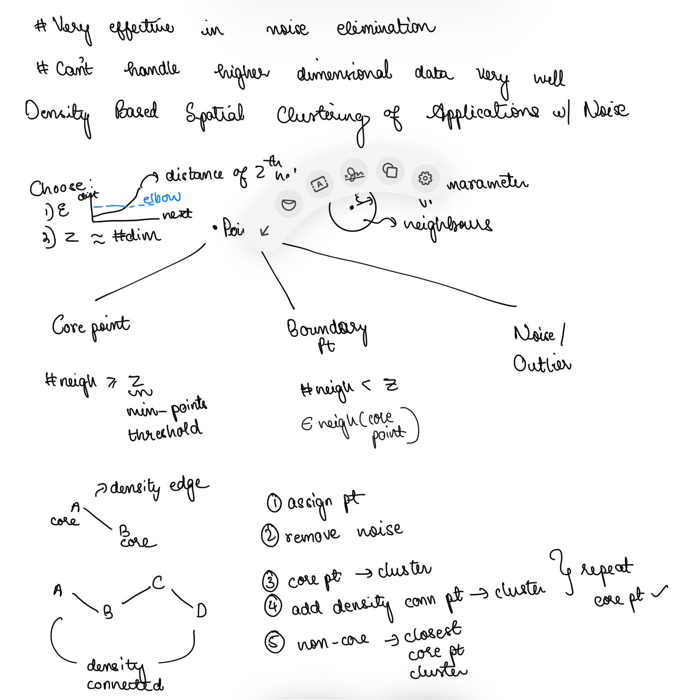

# DBSCAN (Density-Based Spatial Clustering of Applications with Noise)

## Pre learning

There are families of clustering algorithms, partition based(K-Means), hierarchical based (Agglomerative Clustering), density based (DBSCAN), and Model Based (Gaussian Mixture Models).

High dimensional data makes distance-based clustering tricky because of the curse of dimensionality.

k-means fails when clusters are non-spherical or have different-density clusters. GMM assums Gaussian distribution of clusters. DBSCAN does not have need k in advance and works with arbitrary shaped clusters.

### DBSCAN

Density, Clustering, Noise
Use density to cluster the datapoints.

